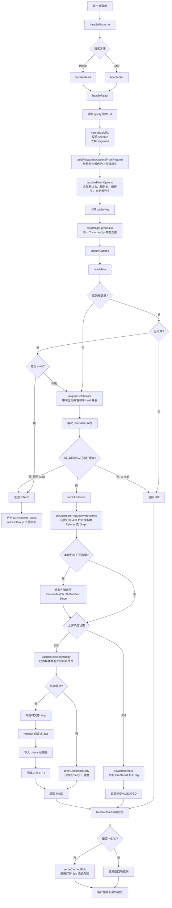

# FreshRSS 图片缓存服务

这是一个单文件 Go 服务，用于为 FreshRSS 拉取并缓存上游图片或视频资源，减少重复请求并降低上游访问压力。

## 功能说明

- 提供 `GET /healthz` 健康检查接口
- 提供 `GET /piccache?url=...` 读取缓存或从上游抓取资源
- 提供 `HEAD /piccache?url=...` 只返回响应头，可用于探测缓存状态与资源元信息
- 提供 `POST /piccache` 主动预热缓存，需传入 `url` 和 `access_token`
- 支持按域名配置上游请求头，例如 `Referer`、`Origin`、`User-Agent`、`Accept-Language`
- 支持 `POST /piccache` 受控透传白名单请求头到上游，适配需要登录态或动态 `Referer` 的图片源
- 支持 `GET /piccache` 从当前请求继承非敏感白名单头到上游；若未提供 `Referer` / `Origin`，会从目标 URL 自动推导并在 403 时有限回退
- 内置 SSRF 防护，解析目标 host 后会先校验每个 IP，再仅连接已验证通过的 IP，拒绝访问私网、回环、链路本地、多播和未指定地址
- 采用磁盘分片缓存，并支持 TTL 过期清理和最大容量淘汰
- 命中路径使用进程内元数据 LRU，减少高并发读盘
- 支持过期缓存 `stale-while-revalidate`，优先返回旧内容并后台刷新
- 支持启动后异步预热元数据和按 shard 渐进式 janitor 清理
- 支持条件回源校验和单 host 并发限制，降低热点回源压力
- 支持优雅停机，收到 `SIGINT` / `SIGTERM` 后会先停止后台预热与 janitor，再在超时窗口内关闭 HTTP 服务

## 缓存布局

磁盘缓存采用“两级 shard 目录 + 一对文件”的布局：

- 二进制响应体写入 `*.bin`
- 元数据写入紧凑的 `*.meta`
- `cacheKey` 前两级前缀会被拆成目录，避免单目录文件过多

例如：

```text
cache/
  ab/
    cd/
      abcd1234.meta
      abcd1234.bin
```

之所以把元数据从 JSON 改成紧凑的 `.meta`，主要是为了降低以下路径的编解码和磁盘字节量：

- `MISS` / `REVALIDATED` 时的元数据写盘
- 冷命中回读元数据
- 启动预热 `warmMetaCache()`
- janitor 的过期清理和容量扫描

## 后台扫描策略

当前版本没有维护单独的索引文件，而是把“磁盘目录本身”作为事实来源。

后台预热和 janitor 的做法是：

- 先列出所有 shard 目录
- 再对每个 shard 用一次 `ReadDir`
- 同时收集该目录下的 `.meta` 和 `.bin`
- 通过文件名反推出 `cacheKey`
- 尽量直接复用目录项信息，减少重复 `stat` 和重复路径拼接

这样做的取舍是：

- 优点是实现简单、状态一致性更直接，不需要维护额外索引
- 缺点是后台任务仍然需要枚举真实文件，缓存规模很大时扫描成本会继续上升

为了进一步减少后台扫描开销，当前实现还会把 `.meta` 文件的 `ModTime` 对齐到 `Meta.CreatedAt`，让 janitor 和预热可以先用文件时间判断是否过期，再决定是否需要解码元数据。

## 环境变量

| 变量名 | 默认值 | 说明 |
| --- | --- | --- |
| `LISTEN_ADDR` | `127.0.0.1:9090` | HTTP 监听地址 |
| `CACHE_DIR` | `./data/cache` | 缓存根目录 |
| `ACCESS_TOKEN` | `change-me` | 主动预热接口使用的访问令牌；这是占位值，启动前必须显式覆盖 |
| `FETCH_TIMEOUT` | `15s` | 上游抓取超时时间 |
| `MAX_BODY_BYTES` | `20971520` | 上游响应体最大字节数 |
| `CACHE_TTL` | `720h` | 缓存过期时间 |
| `JANITOR_INTERVAL` | `1h` | 清理任务执行间隔 |
| `MAX_CACHE_BYTES` | `10737418240` | 缓存允许的最大总大小 |
| `UPSTREAM_CONCURRENCY` | `64` | 同时抓取上游资源的并发上限 |
| `UPSTREAM_CONCURRENCY_PER_HOST` | `8` | 单个上游 host 的并发抓取上限 |
| `META_CACHE_ENTRIES` | `4096` | 进程内元数据 LRU 容量 |
| `BLOB_CACHE_ENTRIES` | `256` | 进程内小文件 blob LRU 的最大条目数 |
| `BLOB_CACHE_MAX_BYTES` | `67108864` | 进程内小文件 blob LRU 的总字节上限，默认 64MB |
| `BLOB_FILE_MAX_BYTES` | `524288` | 单个响应体进入 blob 内存缓存的最大字节数，默认 512KB |
| `STALE_GRACE_PERIOD` | `10m` | 缓存过期后仍可返回旧内容并后台刷新的宽限时间 |
| `WARM_META_ON_START` | `true` | 启动后是否异步预热磁盘元数据到内存 |
| `WARM_META_ENTRIES` | `2048` | 启动预热最多加载的元数据条目数 |
| `JANITOR_SHARD_BATCH` | `32` | 每轮 janitor 扫描的 shard 目录数量 |
| `CLEAN_EXPIRED_ON_START` | `true` | 启动后是否异步全量清理已过期缓存 |
| `UPSTREAM_HEADER_RULES_JSON` | 空 | 按域名匹配的上游请求头规则，JSON 数组 |
| `CREDENTIAL_FORWARD_HOSTS` | 空 | 允许通过 `POST /piccache` 透传 `Cookie`/`Authorization` 的域名白名单，逗号分隔，支持 `*.example.com` |

## 上游请求头规则

`UPSTREAM_HEADER_RULES_JSON` 使用 JSON 数组配置，示例：

```json
[
  {
    "name": "example-cdn",
    "hosts": ["img.example.com", "*.img.example.com"],
    "referer": "https://www.example.com/post/123",
    "origin": "https://www.example.com",
    "user_agent": "Mozilla/5.0 (Windows NT 10.0; Win64; x64)",
    "accept_language": "zh-CN,zh;q=0.9,en;q=0.8",
    "headers": {
      "Cache-Control": "no-cache"
    }
  }
]
```

说明：

- 域名规则仅适合无敏感凭证的静态请求头，例如 `Referer`、`Origin`、`User-Agent`
- 规则会参与公共缓存分片；不同请求头组合会生成不同缓存键，避免互相污染
- 不建议在规则中放入 `Cookie` 或 `Authorization`

## POST 透传上游请求头

`POST /piccache` 现在支持可选的 `upstream_headers` 字段：

```json
{
  "url": "https://target.example.com/image.jpg",
  "access_token": "change-me",
  "upstream_headers": {
    "Referer": "https://target.example.com/post/123",
    "Cookie": "session=abc"
  }
}
```

限制如下：

- 只允许透传 `Referer`、`Origin`、`Cookie`、`Authorization`、`User-Agent`、`Accept-Language`
- `Cookie` 和 `Authorization` 仅允许发往 `CREDENTIAL_FORWARD_HOSTS` 白名单域名
- 带 `Cookie` 或 `Authorization` 的抓取结果不会进入公共缓存，避免用户态资源泄漏

## GET 继承请求头

`GET /piccache?url=...` 在缓存未命中时，会从当前请求自动继承以下非敏感请求头到上游：

- `Referer`
- `Origin`
- `User-Agent`
- `Accept-Language`

如果当前请求没有显式提供 `Referer` / `Origin`，服务会基于目标 URL 自动推导：

- 优先尝试注册域根站点，例如 `https://hellogithub.com/`
- 若上游返回 `403 Forbidden`，再回退尝试目标 host 根路径，例如 `https://img.hellogithub.com/`

这意味着像 `https://img.hellogithub.com/...` 这类基于主站 `Referer` 防盗链的图片源，即使调用方不手工补头，首次 `GET` 也有机会直接抓图并缓存。

## HEAD 探测

`HEAD /piccache?url=...` 与 `GET` 使用同一套缓存和回源逻辑：

- 命中缓存时直接返回响应头
- 未命中缓存时会回源抓取、写入缓存，再返回响应头
- 响应不包含 body

适合用于查看：

- `X-Piccache-Status`
- `Content-Type`
- `Content-Length`
- `ETag`
- `Last-Modified`

## 代码导读

如果你是 Go 初学者，建议不要从工具函数开始零散地看，而是按下面顺序读：

1. 看程序怎么启动
   先看 `main.go` 里的 `main()` 和 `NewServer()`。
   这里能看明白服务是怎么读取配置、初始化 HTTP 客户端、启动预热任务和 janitor 的。

2. 看一次请求怎么进来
   再看 `handlePiccache()`、`handleGet()`、`handleHead()`、`handlePost()`。
   这一层主要是路由分发，不需要纠结细节，先建立“请求会流到哪里”的地图。

3. 重点看 GET / HEAD 主链路
   然后看 `handleRead()`。
   这是最值得先读懂的函数，因为它把“标准化 URL、构造抓取参数、singleflight 去重、返回缓存文件”都串起来了。

4. 看缓存判定核心
   接着看 `ensureCached()`。
   这个函数决定一条请求最后是：
   `HIT`
   `MISS`
   `STALE`
   `REVALIDATED`
   也就是命中、未命中、过期但先返回旧内容、还是通过 304 重验证。

5. 看真正回源和落盘
   再看 `fetchAndStore()`、`drainUpstreamBody()`、`serveCachedBlob()`。
   这里能看懂：
   为什么先校验内容类型
   为什么写临时文件再 rename
   为什么热路径不再用 `ServeFile`

6. 看元数据缓存
   接着看 `readMeta()`、`readMetaFromMemory()`、`writeMetaToMemory()`、`deleteMetaCache()`。
   这一组函数解释了为什么高并发 hit 不需要每次都读磁盘上的 `.meta`。

7. 看过期和后台刷新
   然后看 `canServeStale()`、`refreshStaleCache()`、`conditionalHeaders()`、`revalidateMeta()`。
   这一组是“过期缓存还能先顶住”和“怎么用 304 避免重下整个文件”的关键。

8. 看并发限制
   再看 `acquireFetchSlots()` 和 `hostSemaphore()`。
   这里能理解“为什么不仅有全局并发限制，还要有单 host 并发限制”。

9. 看自动推导防盗链请求头
   再看 `resolveFetchOptions()`、`buildForwardedOptions...()`、`inferUpstreamHeaderOptions()`。
   这是这个服务适配很多图片源时比较有特色的一块。

10. 最后看后台任务和工具函数
    收尾时再看 `warmMetaCache()`、`runJanitor()`、`cleanupExpiredFiles()`、`cleanupOversizeCache()` 以及下面的解析工具函数。
    这时你已经知道主流程了，再看这些辅助逻辑会容易很多。

11. 最后补看安全边界和生命周期
    建议再看 `safeDialContext()` 和 `run()`。
    前者负责把“DNS 解析后的 IP 校验”和“实际 TCP 连接”绑在一起，避免 DNS 重解析绕过 SSRF 防护；
    后者负责把 HTTP 服务、预热任务和 janitor 绑定到同一个可取消 context 上，实现优雅停机。

如果你想结合测试一起看，推荐这样配对：

- 看完 `handleRead()` / `ensureCached()` 后，对照 `main_test.go` 里的 `TestHandleGetForwardsSafeHeadersAndCachesResult`、`TestHandleHeadFetchesAndCachesWithoutBody`
- 看完 `stale` 和 `revalidate` 逻辑后，对照 `TestEnsureCachedServesStaleAndRefreshesInBackground`、`TestEnsureCachedUsesConditionalRevalidation`
- 看完内存元数据缓存后，对照 `TestConcurrentCacheHitsUseMemoryMetaCache`、`TestMetaCacheLRUEvictsOldEntries`
- 看完 janitor 和预热后，对照 `TestWarmMetaCacheLoadsDiskEntries`、`TestCleanupExpiredFilesProcessesOnlySelectedShards`

一个更实用的阅读建议是：

- 第一遍先只看函数注释和函数签名，不追每个分支
- 第二遍从 `handleRead()` 一路点到 `ensureCached()` 和 `fetchAndStore()`
- 第三遍再看并发、LRU、janitor 这些“不是先跑通主链路也能暂时放一放”的部分

## 请求流程图

下面这张 Mermaid 流程图描述的是最常见的 `GET / HEAD /piccache?url=...` 主链路：



如果你想把这张流程图和代码对应起来，推荐对照下面几个函数一起看：

- 入口：`handlePiccache()`、`handleRead()`
- 缓存判定：`ensureCached()`
- 回源与落盘：`fetchAndStore()`
- stale / revalidate：`canServeStale()`、`refreshStaleCache()`、`revalidateMeta()`
- 文件返回：`serveCachedBlob()`

## 后台维护链路

如果你准备看预热、janitor 和容量淘汰，推荐按下面顺序看：

1. `listShardDirs()` 和 `listShardFiles()`
   先建立“后台任务如何枚举磁盘缓存”的地图。

2. `isExpiredFromTime()`
   这是后台路径为什么能先看 `.meta` 文件时间、少解码元数据的关键。

3. `warmMetaCache()`
   看启动后如何把磁盘上的热点元数据搬回进程内 LRU。

4. `cleanupExpiredFiles()` 和 `scanCacheEntries()`
   前者负责 TTL 过期清理，后者负责容量扫描。

5. `cleanupOversizeCache()`
   最后看容量超限时怎样按最旧文件优先淘汰。

## 本地运行

```bash
go run .
```

## 运行测试

```bash
go test ./...
```

最近新增了两类回归测试，后续改动这两块逻辑时建议优先关注：

- `TestSafeDialContextUsesValidatedIPAddress`、`TestSafeDialContextRejectsPrivateAddress`
- `TestRunJanitorStopsOnContextCancel`

## Docker 构建与运行

```bash
docker build -t freshrss-image-cache-service .
docker run --rm -p 9090:9090 freshrss-image-cache-service
```

当前 Docker 构建阶段使用 Go 1.25，与仓库中的 `go.mod` 版本要求保持一致。

容器启动时会先尝试修复 `CACHE_DIR` 的目录权限，再以 `app` 用户启动主程序。这可以改善宿主机绑定挂载目录时的权限兼容性；如果宿主机启用了更严格的文件系统或安全策略，仍可能需要手动调整目录属主或改用 Docker 命名卷。

服务已支持优雅停机：收到 `SIGINT` / `SIGTERM` 后，会先取消后台预热和 janitor，再调用 `http.Server.Shutdown()` 给进行中的 HTTP 请求一个有限收口窗口。默认实现使用 10 秒超时；如果请求长时间卡住或上游持续无响应，超过这个窗口后进程仍会退出。

## GitHub 自动构建镜像

仓库已添加 GitHub Actions 工作流：

- [`docker.yml`](/c:/Dev/Code/go-workspace/freshrss-image-cache-service/.github/workflows/docker.yml)

工作流触发规则如下：

- 推送到 `main` 分支时自动构建并推送 `latest`
- 推送形如 `v1.0.0` 的标签时自动推送对应版本标签
- 同时会生成一个基于提交哈希的镜像标签，便于回滚

镜像会被推送到 GitHub Container Registry，地址格式如下：

```text
ghcr.io/<你的 GitHub 用户名或组织名>/freshrss-image-cache-service:<标签>
```

例如：

```text
ghcr.io/example-user/freshrss-image-cache-service:latest
ghcr.io/example-user/freshrss-image-cache-service:v1.0.0
```

### GitHub 侧准备

1. 将代码仓库推送到 GitHub。
2. 确认默认分支为 `main`，或者自行修改工作流中的分支名。
3. 确认仓库允许 GitHub Actions 使用 `GITHUB_TOKEN` 推送包到 `ghcr.io`。
4. 首次推送后，到 GitHub 的 Packages 页面确认镜像已经生成。

### VPS 拉取镜像

如果镜像是公开的，直接拉取：

```bash
docker pull ghcr.io/<你的 GitHub 用户名或组织名>/freshrss-image-cache-service:latest
```

如果镜像是私有的，需要先登录 GHCR：

```bash
echo <你的 GitHub Token> | docker login ghcr.io -u <你的 GitHub 用户名> --password-stdin
docker pull ghcr.io/<你的 GitHub 用户名或组织名>/freshrss-image-cache-service:latest
```

### VPS 运行示例

```bash
docker run -d \
  --name freshrss-image-cache-service \
  --restart unless-stopped \
  -p 9090:9090 \
  -e LISTEN_ADDR=0.0.0.0:9090 \
  -e CACHE_DIR=/data/cache \
  -e ACCESS_TOKEN=please-change-this \
  -v /opt/freshrss-image-cache-service/cache:/data/cache \
  ghcr.io/<你的 GitHub 用户名或组织名>/freshrss-image-cache-service:latest
```
